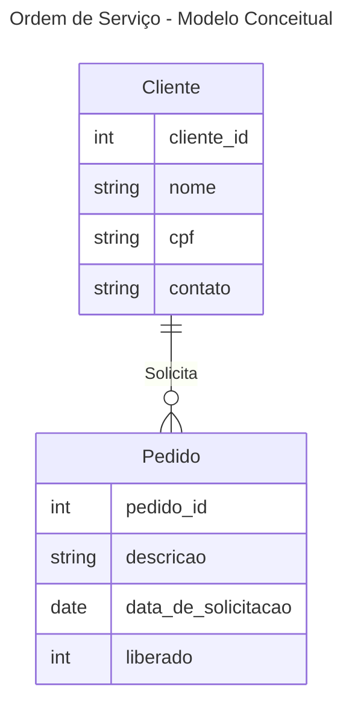

```mermaid
---
title: Ordem de Serviço - Modelo Conceitual 
---

erDiagram 
    Cliente ||--o{ Pedido : Solicita
    Cliente {
        int cliente_id
        string nome
        string cpf 
        string contato 
    }
    Pedido {
        int pedido_id
        string descricao
        date data_de_solicitacao
        int liberado
    }
```
