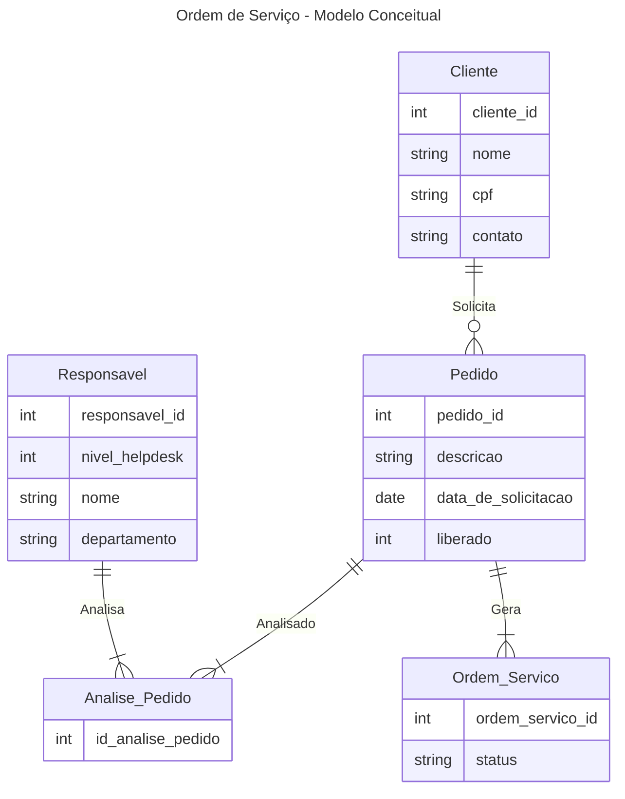

```mermaid
---
title: Ordem de Serviço - Modelo Conceitual 
---

erDiagram 
    Cliente ||--o{ Pedido : Solicita
    Cliente {
        int cliente_id
        string nome
        string cpf 
        string contato 
    }
    Pedido {
        int pedido_id
        string descricao
        date data_de_solicitacao
        int liberado
    }
    Pedido ||--|{ Analise_Pedido : Analisado
    Pedido ||--|{ Ordem_Servico : Gera
    Analise_Pedido {
        int id_analise_pedido 
    }
    Responsavel ||--|{ Analise_Pedido : Analisa
    Responsavel {
        int responsavel_id
        int nivel_helpdesk
        string nome
        string departamento
    }
    Ordem_Servico {
        int ordem_servico_id
        string status
    }
```
